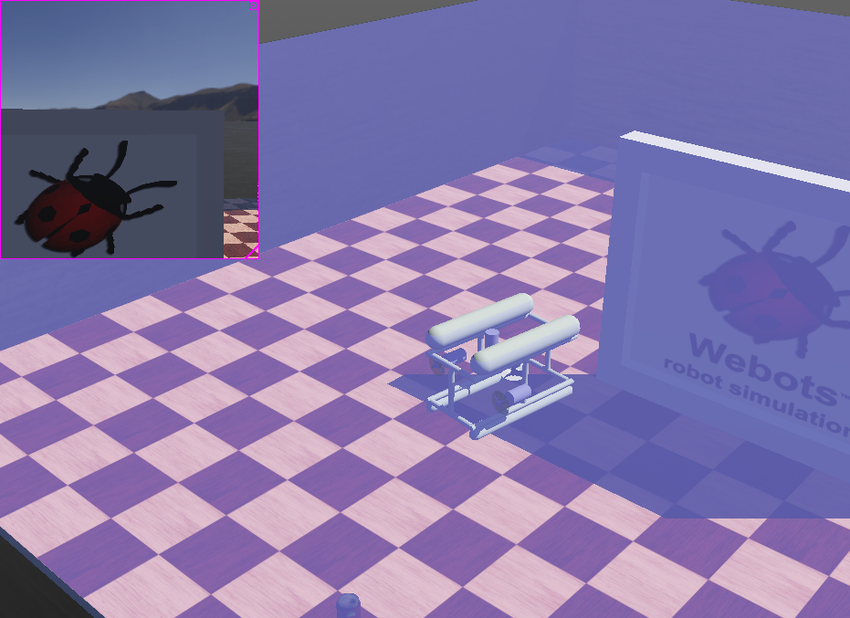
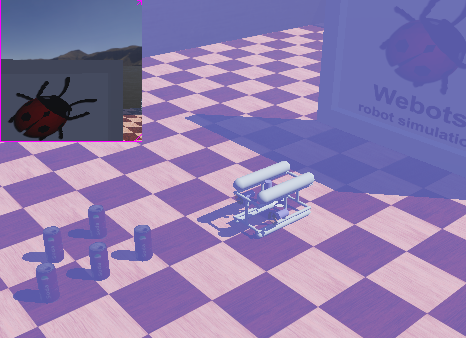

# Webots-ROUV-simulation

A simple, ROUV simulated using [Webots](https://cyberbotics.com) open source robot simulator.
<!--

-->

https://user-images.githubusercontent.com/98900145/223086730-952ff910-ab90-4f4d-896f-fd25a3edaa42.mp4

---

### Quick start

This robot is a simple ROUV which can travel on water surface and dive in the bottom. Robot can be controlled using keyboard inputs. Arrow keys are used to travel forward, backward, turn left and right. "W" and "S" is used float and dive. From the camera mounted infront of the robot, environment can be observed.

---
<!--

-->

https://user-images.githubusercontent.com/98900145/223086871-1bbcf6ad-7e43-49ba-9757-125854e29cbd.mp4

